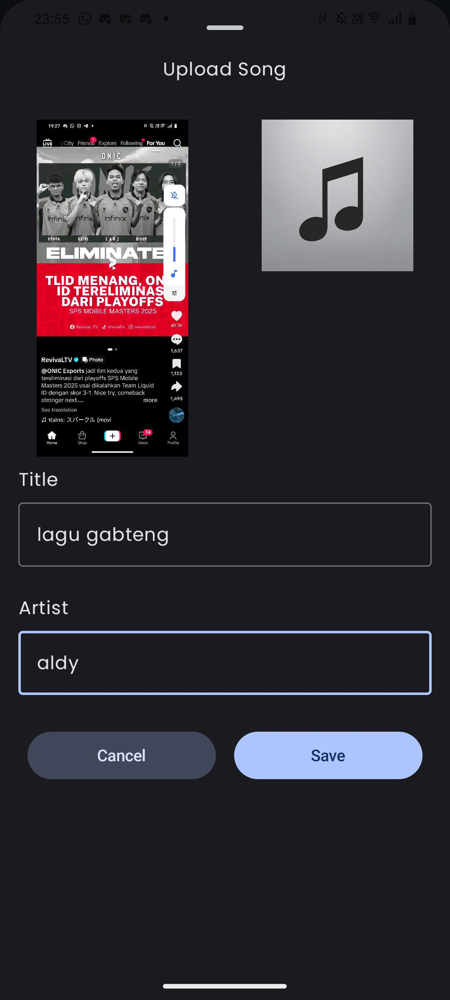

# Purrytify - ADB

> Tugas Besar Pengembangan Aplikasi Piranti Bergerak Kelompok **[ADB]**
>
> Oleh:<br>
> 1. 13522022 Renaldy Arief Susanto<br>
> 2. 13522066 Nyoman Ganadipa Narayana<br>
> 3. 13522094 Andhika Tantyo Anugrah<br>
>
> Sekolah Teknik Elektro dan Informatika<br>
> Institut Teknologi Bandung<br>
> Semester VI Tahun 2024/2025

## Table of Contents
* [Application Description](#application-description)
* [Milestone Features](#milestone-features)
* [Library Used](#library-used)
* [Screenshots](#screenshots)
* [Contribution](#contribution)
* [Work Hour](#work-hour)
* [Bonus Implementation](#bonus-implementation)
* [Installation & Setup](#installation--setup)
* [Links](#links)

## Application Description
Purrytify is a comprehensive music streaming application designed to help Purry fight against Dr. Asep Spakbor with modern features and a vast collection of music. This Android app, developed using Android Studio in Kotlin, serves as the ultimate weapon to restore happiness to the world through the melody of songs.

The application combines local music playback capabilities with online streaming features, advanced analytics through Sound Capsule, and seamless sharing functionalities. With its intuitive interface and powerful background services, Purrytify delivers an exceptional music experience across all scenarios.

## Milestone Features

### Milestone 1 Features (ALL DONE) ✅
- **User Authentication**: Login and logout functionality
- **Local Music Library**: Browse and play local music files
- **Music Player**: Full-featured player with play/pause, next/previous controls
- **Liked Songs**: Save and manage favorite tracks
- **Profile Management**: User profile display and basic information
- **Background Service**: Continue music playback when app is minimized
- **Network Sensing**: Handle network connectivity changes
- **Database Integration**: Local storage for user data and preferences

### Milestone 2 Features (ALL DONE) ✅
- **Online Songs**: Access trending songs globally and by country
  - Top 50 Global songs from server
  - Top 10 Country-specific songs (ID, MY, US, GB, CH, DE, BR)
  - Stream online music with artwork display
- **Download Online Songs**: Download server songs for offline playback
- **Sound Capsule (Analytics)**: Real-time music analytics with export functionality
  - Time listened tracking
  - Top artist statistics
  - Top song statistics  
  - Day-streak tracking for consecutive listening
  - Export to CSV/PDF format
- **Notification Controls**: Background music control via notifications
  - Persistent notification during playback
  - Play/pause, next/previous controls
  - Lock screen and notification shade access
  - Direct app navigation from notification
- **Audio Routing & Output Device**: External audio device selection
  - Bluetooth speaker/headset detection
  - Device selection interface
  - Active device indicator
  - Automatic fallback handling
- **Share Songs via URL**: Deep linking for song sharing
  - Generate shareable URLs for server songs
  - Android ShareSheet integration
  - Deep link handling: `purrytify://song/<song_id>`
- **Share Songs via QR**: QR code generation and scanning
  - QR code generation for song URLs
  - QR scanner with camera integration
  - Image sharing via ShareSheet
- **Responsive Design**: Portrait and landscape orientation support
- **Edit Profile**: Update user information
  - Location management with GPS and manual selection
  - Profile photo upload from gallery/camera
  - Google Maps integration for location selection
- **Song Recommendations**: Automated song curation
  - Daily playlist generation
  - Genre-based top mixes
  - Algorithm based on user preferences

## Library Used

### Core Android Libraries
- **androidx-core-ktx**: Kotlin extensions for Android
- **androidx-lifecycle-runtime-ktx**: Lifecycle-aware components
- **androidx-activity-compose**: Activity integration with Compose
- **androidx-compose-bom**: Compose Bill of Materials
- **androidx-ui**: UI toolkit components
- **androidx-ui-graphics**: Graphics utilities for Compose
- **androidx-ui-tooling-preview**: Preview support for Compose
- **androidx-material3**: Material Design 3 components

### Dependency Injection
- **hilt-android**: Dependency injection framework
- **hilt-android-compiler**: Hilt annotation processor
- **hilt-navigation-compose**: Hilt integration with Navigation Compose

### UI & Navigation
- **accompanist-systemuicontroller**: System UI control
- **cardview**: Card-based layouts
- **recyclerview**: Efficient list displays
- **recyclerview-selection**: Selection support for RecyclerView
- **navigation-compose**: Navigation component for Compose
- **material-icons-extended**: Extended Material Design icons
- **palette-ktx**: Color extraction from images

### Lifecycle & Data
- **lifecycle-livedata-ktx**: LiveData with Kotlin extensions
- **runtime-livedata**: LiveData runtime support for Compose

### Network & API
- **converter-gson**: JSON conversion for Retrofit
- **retrofit**: HTTP client for API communication
- **okhttp-bom**: OkHttp Bill of Materials
- **okhttp**: HTTP client
- **logging-interceptor**: Network request logging

### Database
- **room-ktx**: Room database with Kotlin extensions
- **room-runtime**: Room database runtime
- **room-compiler**: Room annotation processor (KSP)

### Media & Audio
- **media3-common**: Media3 common components
- **media3-exoplayer**: ExoPlayer for audio playback
- **media3-ui**: Media3 UI components
- **media3-session**: Media session support
- **work-runtime-ktx**: Background work management

### Image Loading
- **coil**: Modern image loading library
- **coil-compose**: Coil integration with Compose
- **coil-network-okhttp**: Coil network layer with OkHttp

### Location & Maps
- **play-services-location**: Google Play Services Location
- **play-services-maps**: Google Maps for Android
- **osmdroid-android**: OpenStreetMap Android library
- **osmdroid-wms**: OSM WMS support
- **osmdroid-mapsforge**: OSM Mapsforge support

### Security & Utilities
- **security-crypto-ktx**: Encrypted storage
- **qrgenerator**: QR code generation library

## Screenshots

### Milestone 1 Screenshots
| | | |
|:---:|:---:|:---:|
|  |  |  |
|  |  |  |
|  |  | |


### Milestone 2 Screenshots
|  |  |  |
|---|---|---|
|  |  |  |
|  |  |  |
|  |  |  |
|  |  |  |


## Contribution

### Milestone 1
1. **13522022 Renaldy Arief Susanto**: Home, Library, Music Playback, Liked Songs
2. **13522066 Nyoman Ganadipa Narayana**: Login, Logout, Background Service, Header Navbar, Database integration (home, profile, liked songs)
3. **13522094 Andhika Tantyo Anugrah**: Add Songs, Profile, Network Sensing

### Milestone 2
1. **13522022 Renaldy Arief Susanto**: Notification controls, Audio routing & output device, Halaman responsive
2. **13522066 Nyoman Ganadipa Narayana**: Edit profile, rekomendasi lagu, Sound capsule, Share sound capsule as image
3. **13522094 Andhika Tantyo Anugrah**: Online songs, download online songs, Share songs via URL+QR, Server song intergration


## Work Hour

### Milestone 1
1. **13522022 Renaldy Arief Susanto**: ~60 hours (study: 15 hours, work: 45 hours)
2. **13522066 Nyoman Ganadipa Narayana**: ~60 hours (study: 15 hours, work: 45 hours)
3. **13522094 Andhika Tantyo Anugrah**: ~60 hours (study: 15 hours, work: 45 hours)

### Milestone 2
1. **13522022 Renaldy Arief Susanto**: ~50 hours 
2. **13522066 Nyoman Ganadipa Narayana**: ~50 hours 
3. **13522094 Andhika Tantyo Anugrah**: ~50 hours 

### Total Project Hours
1. **13522022 Renaldy Arief Susanto**: ~110 hours
2. **13522066 Nyoman Ganadipa Narayana**: ~110 hours
3. **13522094 Andhika Tantyo Anugrah**: ~110 hours

## Bonus Implementation

### 1. Share Sound Capsule ✅
- Generate shareable images of Sound Capsule analytics
- Social media integration via ShareSheet
- Custom visual design for analytics sharing

### 2. Server Songs Integration ✅
- Server songs added to Recently Played playlist
- Like functionality for online songs
- Server songs analytics included in Sound Capsule


## Installation & Setup

### Prerequisites
- Android Studio Hedgehog or newer
- Android SDK API Level 29-34
- Kotlin 1.9+
- Gradle 8.0+

### Setup Instructions
1. Clone the repository:
```bash
git clone https://github.com/Labpro-21/if3210-tubes-mad-2025-if3210-2025-mad-adb
cd if3210-tubes-mad-2025-if3210-2025-mad-adb
```

2. Open project in Android Studio

3. Sync Gradle files

4. Build and run the application

### Required Permissions
- `INTERNET`: Network access for online songs
- `ACCESS_NETWORK_STATE`: Network connectivity monitoring
- `WRITE_EXTERNAL_STORAGE`: Download functionality
- `READ_EXTERNAL_STORAGE`: Local music access
- `CAMERA`: QR code scanning
- `ACCESS_FINE_LOCATION`: Location services for profile
- `FOREGROUND_SERVICE`: Background music playback
- `BLUETOOTH`: Audio device connectivity

## Links
- [Milestone 1 - Android](https://docs.google.com/document/d/1WFKkOpWmswCLCIi4-5ptbk80FJzvuZOE/edit)
- [Milestone 2 - Android](https://docs.google.com/document/d/1WFKkOpWmswCLCIi4-5ptbk80FJzvuZOE/edit)
- [Figma Reference](https://www.figma.com/design/zrLmY0b9FlCWTxBlJjOwBD/MAD?node-id=9-937&t=LCA0k8zLUIT4D9eL-0)
- [Backend API Documentation](http://34.101.226.132:3000)
- [This Repository](https://github.com/Labpro-21/if3210-tubes-mad-2025-if3210-2025-mad-adb)

---
**IF3210 Pengembangan Aplikasi Piranti Bergerak**  
**Teknik Informatika - Institut Teknologi Bandung**  
**2025**
